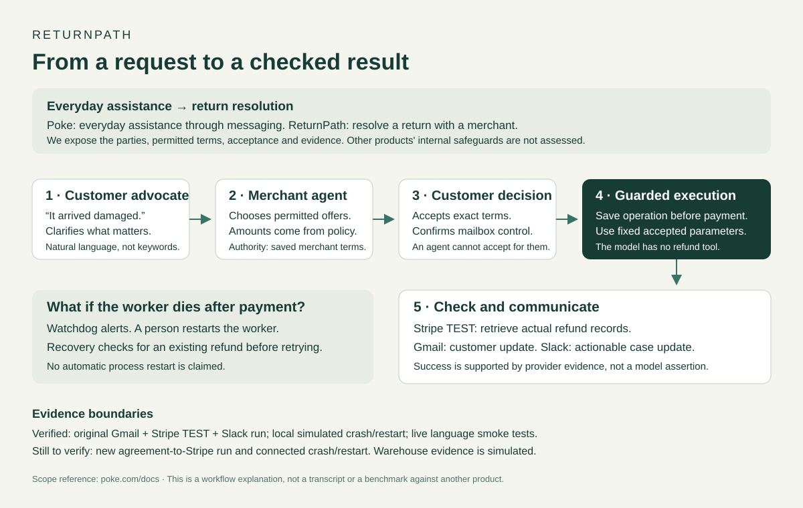

# ReturnPath

## 1. What it does

ReturnPath helps a customer get a return or refund resolved without repeating the same story to support.

A customer can write “the package was broken,” “damanged item,” or describe the problem in their own words. One AI agent helps explain what the customer wants. A second represents the merchant and offers only the options the merchant allows. If something is unclear, they ask a question. The customer reviews and accepts the exact terms.

**Why two agents?** The customer and merchant have different needs. Showing both sides makes it clear what was requested, what was offered and what was agreed.

**Why separate agreement from payment?** A persuasive message is not permission to move money. Code checks the accepted terms, records the operation before sending it, and checks the payment provider afterward. After an interruption, it should find an existing refund rather than create another one.

### What works today

- **Try a resolution:** customer and operator pages, natural-language conversations, different merchant-approved offers, saved agreements and simulated refunds. Offers come from [merchant settings](config/resolutions.json), not amounts invented by an agent.
- **Real app demonstration:** Gmail intake and verification, a $30 Stripe TEST refund on a $100 payment, a customer email and a Slack update. [All three were checked in the same run](evidence/connected-ordinary-run.json).

**Core connection implemented:** an accepted offer can now be prepared as a separate Stripe TEST case, with a new customer verification step and the same guarded refund worker. Its connected refund run still awaits customer confirmation and required return evidence. The playground remains simulated until explicitly connected. Testing a crash during a real Stripe run is still unfinished. The fixed $30 example remains a repeatable test of duplicate-refund prevention.

### How this differs from a general assistant

[Poke](https://poke.com/docs) offers everyday help through messaging, including email and calendar tasks. [Instinct](https://instinct.com/) describes a personal assistant you can text or call to act across apps and devices.

ReturnPath focuses on one job: resolving a return with a merchant. It makes the two parties, permitted offers, accepted terms and payment evidence visible. Its main experiment asks what happens if a payment succeeds but the worker dies before saving the result. This is a difference in scope and what we test, not a claim that those products lack safeguards or that we have outperformed them.



[Workflow visual](docs/images/returnpath-workflow.svg) · [Suggested recording narration](docs/RECORDING_GUIDE.md)

## 2. External apps

| App | Why we use it |
|---|---|
| Gmail | Customers can contact support by email and receive verification and refund updates. |
| Stripe | Creates the TEST refund and provides records we can check independently. |
| Slack | Gives the support operator a case update, supporting facts and the next action. |

These are the three connected apps. The model API and simulated warehouse do not count as additional apps. No real money is moved.

## 3. Run it

Requires Python 3.12. Setup uses a project-specific environment and locked dependencies so installations are repeatable.

```bash
cd ~/testingxd
make setup
make init-config
make playground
```

Open **http://127.0.0.1:8001/playground**. The default uses a simple offline test substitute for the AI.

For real AI conversations, follow the [credentials checklist](docs/CREDENTIALS_CHECKLIST.md), set `RP_MODE=connected-test` in the private configuration, then run:

```bash
RP_RESOLUTION_MODEL=live make playground
```

Choose a purchase, describe the problem, answer any questions and accept an offer. For the operator view, open `/login`, then `/resolutions`. Use a separate browser profile to keep customer and operator sessions separate.

For the Gmail/Stripe/Slack demonstration, complete the same checklist, enable controlled TEST writes and run:

```bash
make doctor
make connected-seed    # once for a NEW test case only
make connected-dev
```

Send an email from the configured customer mailbox with `order 4127` in the body, then confirm the emailed verification link. **For an existing case, restart with only `make connected-dev`. Never reseed it.** Stop with Ctrl+C.

Keep passwords, API keys and Gmail tokens outside the repository. We use SQLite to keep the local setup small and preserve records across restarts.

For an accepted offer, log into `/resolutions`, open the agreement, and choose **Prepare Stripe TEST case / send verification**. This creates one TEST payment matching the purchase price. The trusted customer must confirm the emailed link. If the offer requires a return, the operator must record explicitly simulated warehouse acceptance through **Inspect payment evidence**. Keep `make connected-dev` running; it processes both journals under one worker lock. `make agreement-oracle` independently checks the new agreement refunds. Never prepare a different agreement to escape an uncertain payment attempt.

## 4. How we check reliability

```bash
make test
make lint
make demo
make review-check
make stripe-oracle    # independently reads the existing Stripe TEST refund
make submission-check
```

- **82 tests passed:** [test report](evidence/offline-evaluation.md). Checks include customer access, changed or expired offers, repeated acceptance and repeated refund attempts.
- **Local crash test passed:** [recorded result](evidence/local-demo.json). A process is killed after the simulated provider saves a refund, then restarted. The independent check finds one refund. This has not yet been repeated with Stripe.
- **Real Stripe check passed:** one $30 refund on the $100 TEST payment, verified from provider records rather than the app's success label.
- **Four language examples passed:** [actual model results](evidence/language-smoke.json), including typos and clarification replies. This is a small check, not proof that every conversation works.

### What the agent is grounded in

The model interprets language; it does not decide what money it may spend. Offers come from saved merchant settings. The customer must accept an exact offer. In the connected workflow, identity is checked through a link sent to the address on the trusted order, and payment status comes from Stripe. A customer saying “it arrived damaged” remains a claim, not verified warehouse evidence. Warehouse acceptance is currently simulated.

### What happens when something fails

| Principle | What the code does and why |
|---|---|
| Save before acting | Records the refund identity, fixed parameters and attempt before calling the provider. A restart must use the same operation. |
| Check before retrying | Reads all refund pages and checks existing provider records. A timeout does not mean the refund failed. |
| Bound retries | Uses the same payment key, at most three attempts within 23 hours, with backoff. It stops for review rather than trying forever or changing the key. |
| Keep uncertainty visible | Missing or conflicting facts cannot authorize another payment. An uncertain outcome email is not blindly resent. |
| Separate detection from recovery | A separate watchdog detects a stale worker. A person restarts it; the worker then checks provider records to recover its state. This is tested recovery after restart, not automatic self-healing. |
| Check results independently | Tests inspect the provider's records, not just the app's “success” flag. A negative test deliberately creates a duplicate refund to show that the checker catches it. |

These payment rules apply to the connected fixed-amount workflow. The offer workflow separately tests changed terms, expired offers, other customers' access and repeated acceptance. Connected agreement cases use a separate durable payment journal; local tests use simulated providers. A negotiation interrupted during a model call still requires operator inspection.

### Benchmarking and larger scale

The [evaluation script](scripts/resolution_eval.py) runs the same named scenarios repeatedly, with fresh records for each trial and explicit expected outcomes. Reports distinguish actual model calls from the offline substitute. The current evidence is 82 automated tests, 30 repeated offline episodes, three earlier live-model scenarios and four language scenarios. These are different measurements and must not be added together as one success rate. Broad repeated live-model and adversarial testing is still needed.

The current worker runs on one machine and uses an operating-system lock to prevent a second worker from owning the same records. **We have not tested distributed operation or high traffic.** At larger scale, ownership must be enforced across machines, accepted terms must remain durable, and retries must still refer to the same operation. A shared transactional database, worker ownership that survives failover, provider rate-limit handling, and load/failure tests would be required. The present results establish a small, stated failure model—not proof that adding servers will preserve correctness.

Gmail changed our supplied Message-ID, so recovery from an uncertain send still needs work. Prompts and merchant rules stay fixed during a run; there is no online policy rewriting.

Missing evidence keeps `submission-check` blocked. See the [reliability notes](docs/RELIABILITY_BRIEF.md), [implementation status](IMPLEMENTATION_STATUS.md) and [submission manifest](submission.json) for details.

[Build history and AI assistance](docs/PROVENANCE.md) · [Reviewer guide](JUDGE_GUIDE.md)

## 5. Demo

[Watch the demo](https://youtu.be/_smB1ylupvw)
